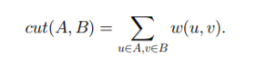
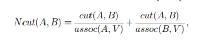
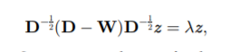
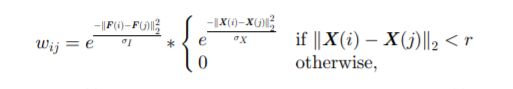
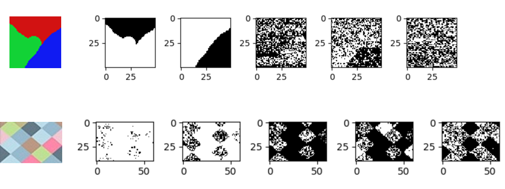

# Normalized-Cut
计算方法project

**1.Problem statement**

​       图像分割是一个传统的问题，但是分割的优良性却很难确定。本文提出了一种新的图论准则来衡量图像分割的优良性——归一化分割。在已有的最小化分割的基础上，加入归一化以去除偏差，便得到了归一化分割的目标函数。其中assoc(A,V)代表区域A中的所有点到图中所有点的边权和。

          

​    要得到精确的最小值是NP-Hard的，但是我们通过一系列数学推导，可以把原问题转化为下面的特征值问题，我们要的分割点就是第二小特征值所对应的特征向量。

 

**2.Algorithm**

\1. 给定一张图像，建立带权重的图 G=(V,E)，设定边的权重W为两点之间的相似度。

\2. 求解 

\3. 使用第二小特征值对应的特征向量来分割这个图。

\4. 需要的话，可以继续递归地分割子图。

 

**3. Numerical solution**

1.将图像中的每个像素看成一个点，每一对连上边，权重如下设置（F是每个点的特征如明度值，X是每个点的坐标，σ为参数）：

2.求解第二小的特征值对应的特征向量。传统的方法是O(n3)的，但由于矩阵稀疏，而且只需要求前几个特征值，所以可以采用Lanczos方法，复杂度仅为O(mn)，其中m为矩阵向量计算的最大次数。

3.得到第二小的特征向量后，选择分割点（可以为0，可以为向量元素的中位数），向量中大于它的为一部分，小于的为另一部分。

4.把图像分割成两部分后，如果需要，可以递归地分别对每个子图再次分割，直到Ncut值达到临界，也就是不可再分了。（还有一种方法：论证表明第三小的特征向量是对前两部分进行最佳细分的解。实际上，可以每次使用下一个最小特征值的特征向量，来细分现有图形）

 

一些简单分割的例子

 

 

**4.Conclusion**

​       把图像分割问题视作图论的分割问题，本文提出了归一化切割的准则，并且证明了广义特征值系统能够为我们提供这个问题的实值解，将它运用到亮度、颜色和纹理图像的分割，能取得较为满意的结果。